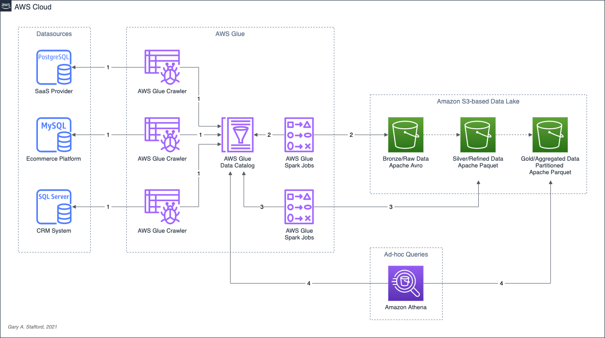

# Data Lake Demo

Source code for video demonstration detailed in the
post, [Building a Simple Data Lake on AWS](https://garystafford.medium.com/building-a-simple-data-lake-on-aws-df21ca092e32)
. Build a simple data lake on AWS using a combination of services, including AWS Glue Data Catalog, AWS Glue Crawlers,
AWS Glue Jobs, AWS Glue Studio, Amazon Athena, and Amazon S3.

## Architecture



## TICKIT Sample Database

[Amazon Redshift TICKIT Sample Database](https://docs.aws.amazon.com/redshift/latest/dg/c_sampledb.html)

## TICKIT Tables

- `tickit.saas.category`
- `tickit.saas.event`
- `tickit.saas.venue`
- `tickit.crm.users`
- `tickit.date`
- `tickit.listing`
- `tickit.sales`

## Naming Conventions

```text
+-------------+--------------------------------------------------------------------+
| Prefix      | Description                                                        |
+-------------+--------------------------------------------------------------------+
| _source     | Data Source metadata only (org. call _raw in video)                |
| _raw        | Raw/Bronze data from data sources (org. call _converted in video)  |
| _refined    | Refined/Silver data - raw data with initial ELT/cleansing applied  |
| _aggregated | Gold/Aggregated data - aggregated/joined refined data              |
+-------------+--------------------------------------------------------------------+
```

## Commands

```shell
DATA_LAKE_BUCKET="your-data-lake-bucket"

aws s3 rm "s3://${DATA_LAKE_BUCKET}/tickit/" --recursive

aws glue delete-database --name tickit_demo

echo '
{
  "DatabaseInput": {
        "Name": "tickit_demo",
        "Description": "Track sales activity for the fictional TICKIT web site"
  }
}' > glue_db.json

aws glue create-database --cli-input-json file://glue_db.json

aws glue get-tables \
  --database-name tickit_demo \
  --query 'TableList[].Name' \
  --output table

aws glue start-crawler --name tickit_postgresql
aws glue start-crawler --name tickit_mysql
aws glue start-crawler --name tickit_mssql

aws glue get-jobs \
  --query 'Jobs[].Name' \
  | sort | grep _raw

aws glue start-job-run --job-name tickit_public_category_raw
aws glue start-job-run --job-name tickit_public_date_raw
aws glue start-job-run --job-name tickit_public_event_raw
aws glue start-job-run --job-name tickit_public_listing_raw
aws glue start-job-run --job-name tickit_public_sales_raw
aws glue start-job-run --job-name tickit_public_users_raw
aws glue start-job-run --job-name tickit_public_venue_raw

aws glue start-job-run --job-name tickit_public_category_refine
aws glue start-job-run --job-name tickit_public_date_refine
aws glue start-job-run --job-name tickit_public_event_refine
aws glue start-job-run --job-name tickit_public_listing_refine
aws glue start-job-run --job-name tickit_public_sales_refine
aws glue start-job-run --job-name tickit_public_users_refine
aws glue start-job-run --job-name tickit_public_venue_refine

aws glue get-tables \
  --database-name tickit_demo \
  --query 'TableList[].Name' \
  --output table
```
